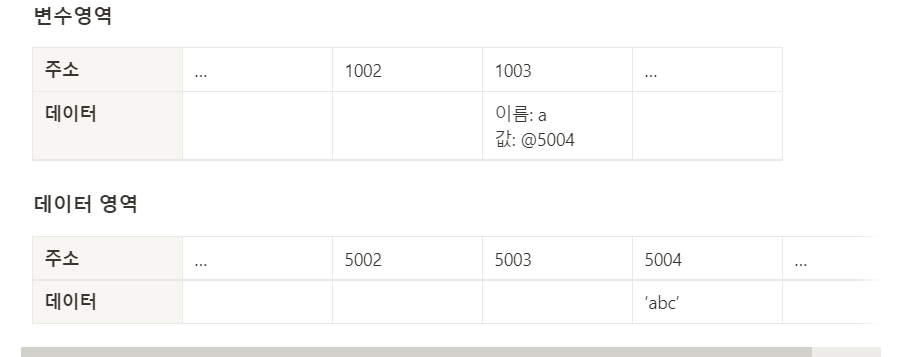

## Index

---
[01 데이터 타입의 종류](#01-데이터-타입의-종류)

[02 데이터 타입에 관한 배경지식](#02-데이터-타입에-관한-배경지식)

[03 변수 선언과 데이터 할당](#03-변수-선언과-데이터-할당)

[04 기본형 데이터와 참조형 데이터](#04-기본형-데이터와-참조형-데이터)

[05 불변객체](#05-불변-객체)

[06 undefined와 null](#06-undefined와-null)

<br>

# 1. 데이터 타입

## 01 데이터 타입의 종류

### 기본형(원시형, Primitive type)

- Number, String, Boolean, null, undefined, Symbol(ES6 추가)
- 값이 담긴 주소값 복제
- 불변성

### 참조형(Reference type)

- object
  - Array, Function, Date, RegExp(정규표현식)
  - ES6 추가 - Map, WeakMap, Set, WeakSet 등
- 값이 담긴 주소값들로 이루어진 묶음을 가리키는 주소값 복제
- **내부 프로퍼티를 변경할 때** **가변성**(참조형 데이터자체를 변경할 경우는 x)

## 02 데이터 타입에 관한 배경지식

### 메모리와 데이터

- 1bit = 0과 1로만 표현하는 메모리 조각
- 1Byte = 8bit = $2^8$
- 모든 데이터는 바이트 단위의 식별자, 즉 메모리 주소값을 통해 구분하고 연결

### 식별자와 변수

- **변수**는 변할 수 있는 수(데이터), 변경 가능한 데이터가 담길 수 있는 공간
- **식별자**는 데이터를 식별하는데 사용하는 이름, **변수명**

## 03 변수 선언과 데이터 할당

### 변수 선언

- **변수**는 변경 가능한 데이터가 담길 수 있는 공간

변수 선언에 대한 메모리 영역 변화

- 컴퓨터는 메모리에서 비어있는 공간 하나(주소 1003)를 정하고, 공간이름(식별자) a라고 지정

  ```jsx
  let a;
  ```

  

### 데이터 할당

<aside>
💡 **변수 값에 바로 값을 저장하는 것이 아니라,
새 메모리 공간에 값의 주소를 저장하고(그 값이 기존에 없으면) 그 주소를 변수 값에 저장**

</aside>

- **변수 영역 데이터 값에 바로 값을 대입하지 않는 이유**
  - 변수에서 확보된 공간을 새로 할당된 데이터 크기에 맞게 늘리는 작업 시,
    특히, 중간에 있는 데이터를 늘려야 하는 상황에서 해당 공간보다 뒤에 저장된 데이터를 뒤로 옮기고, 이동시킨 주소를 각 식별자에 다시 연결해야하는 작업으로 인해 컴퓨터 연산량 많아짐
  - 따라서, **데이터 변환 유연성, 메모리 관리 효율성 때문에 변수 영역에 직접 값 대입하지 않고 데이터 영역을 별도 공간으로 나누어 저장**
  - 기존 문자열에 어떤 변화를 가하든 무조건 새로 만들어 별도 공간에 저장
  - 변화 후, 기존 데이터는 자신의 주소를 저장하는 변수가 하나도 없으면 가비지 컬렉터의 수거 대상이 됨
  - ex) 500개 변수에 숫자 5 할당 시, 숫자형 8byte 필요하므로 4,000(500*8)byte 필요
    → 5를 별도 공간에 한번 저장하고 주소만 입력하면 1,008(500* 주소 공간 크기 2byte+8)byte 필요.
- 데이터 할당 과정 예시
  - 변수 영역 빈공간(@1003) 확보, 확보한 공간 식별자 a 지정
  - 데이터 영역 빈공간(@5004) 문자열 ‘abc’ 저장
  - a영역에서 a 식별자 검색(@1003)
  - 저장한 문자열 주소 (@5004)를 @1003 공간에 대입

    ```jsx
    let a;        // 변수 a 선언
    a = 'abc';    // 변수 a에 데이터 할당
    
    //위 선언과 할당을 한문장으로
    let a = 'abc';
    ```

    

## 04 기본형 데이터와 참조형 데이터

### 불변값

- 변수와 상수 구분하는 성질은 **변경 가능성(변수 영역 메모리)**
  - **변경 가능성 -** 한번 데이터 할당이 이루어진 변수 공간에 다른 데이터 재할당가능 여부

    ```jsx
    //‘abc’의 주소를 a 변수 값에 대입
    let a = 'abc';

    //“abcdef”를 새 공간에 만들고 그 주소를 a에 변수 값에 대입
    a = a + 'def';

    //데이터 영역에서 5 찾고 없으면 새 공간에 5 저장
    let b = 5;
    // 데이터 영역에서 5 찾으면 b에 할당 시 저장한 주소 있으니까 그 주소를 c 값에 저장
    let c = 5;
    // 7 저장유무 판단하고 없으면 새로 만들어서 7 값의 데이터 주소를 b 값에 저장
    b = 7;
    ```

- **즉, 한 번 만든 값을 변경할 수 없다. 한 번 만들어진 값은 가비지 컬렉팅**(하나의 변수에도 사용되지 않으면 수거)**을 당하지 않는 한 영원히 변하지 않는다.**

### 가변값

- 기본형과 달리 **객체의 변수(프로퍼티) 영역** 존재
- 변수, 객체의 변수, 데이터를 갖고 있음
- 객체의 변수 영역은 변할 수 있으므로 가변 값

    ```jsx
    const obj1={
     a: 1,
     b: "abc"
    };
    
    //새로운 객체로 바뀐 것이 아니라 기존 객체 내부의 값만 바뀐 것
    obj1.a = 2;
    ```

    

### 변수 복사 비교

  1. 객체 프로퍼티 변경

  ```jsx
  let a = 10;
  let b = a;
  let obj1 = {
    c:10, 
    d: "bbb"
  };
  let obj2 = obj1;

  b= 15;
  obj2.c = 20;

  // a = 10
  // b = 15

  //obj1 === obj2
  ```


1. 객체 자체 변경

  ```jsx
  let a = 10;
  let b = a;
  let obj1 = {c:10, d: "bbb"};
  let obj2 = obj1;
  
  b = 15;
  obj2.c = 20;
  
  // a = 10
  // b = 15
  
  //obj1 {c:10, d: "bbb"}
  //obj2 {c:20, d: "bbb"}
  ```

  

  <aside>
  💡 **참조형 데이터**가 ‘**가변값**’**이라고 설명할 때는** ‘가변’은 참조형 데이터 자체 변경할 경우가 아니라, **그 내부의 프로퍼티를 변경할때만 성립**

  </aside>

## 05 불변 객체

### 불변 객체를 만드는 간단한 방법

- 불변 객체가 필요한 경우 : 전달받은 객체에 변경을 가하더라도 원본 객체는 변하지 않아야 하는 경우

### 얕은 복사와 깊은 복사

- **얕은 복사**
  - 얕은 복사는 바로 아래 단계의 값만 복사

      ```jsx
      let user = {
        name: "John",
        age: 30
      };
      
      let clone = {}; // 새로운 빈 객체
      
      // 빈 객체에 user 프로퍼티 전부를 복사해 넣습니다.
      for (let key in user) {
        clone[key] = user[key];
      }
      
      // 이제 clone은 완전히 독립적인 복제본이 되었습니다.
      clone.name = "Pete"; // clone의 데이터를 변경합니다.
      
      alert( user.name ); // 기존 객체에는 여전히 John이 있습니다.
      ```

  - but, 중첩 객체를 처리하지 못함(객체안에 객체 존재하는 객체)
  - ****Array.prototype.slice()****

      ```jsx
      const original = ['a', 2, true, 4, "hi"];
      const copy = original.slice();
      ```

  - **Object.assign(생성할 객체, 복사할 객체)**

      ```jsx
      const object = {
        a: "a",
        number: {
        one: 1,
        two: 2,
        },
      };
      
      const copy = Object.assign({}, object);
      ```

  - **Spread 연산자 사용**

      ```jsx
      const object = {
        a: "a",
        number: {
          one: 1,
          two: 2,
        },
      };
        
      const copy = {...object}
      ```

- **깊은복사**
  - 깊은 복사는 내부의 모든 값들을 하나하나 찾아서 전부 복사하는 방법
  - ****JSON.parse && JSON.stringify****
    - but, 메서드(함수) 숨겨진 프로퍼티 등 JSON으로 변경 불가한 프로퍼티 모두 무시

        ```jsx
        const object = {
          a: "a",
          number: {
            one: 1,
            two: 2,
          },
          arr: [1, 2, [3, 4]],
         func1: function(){ console.log(3)} // 여기는 밑에 복사시 안됨.
        };
         
        const copy = JSON.parse(JSON.stringify(object));
        ```

  - 재귀 함수

      ```jsx
      const copyObjectDeep = function(target){
        let result = {};
        // typeof 명령어가 null도 object로 반환하는 자바스크립트 자체 버그 때문
        if (typeof target === 'object' && target !== null){ 
        for(let prop in target){
          result[prop] = copyObjectDeep(target[prop]);
        }
        }
        else{
        result = target;
        }
        return result;
      };
      ```

  - Lodash 라이브러리(설치해야 함)

      ```jsx
      const deepCopy = require("lodash.clonedeep")
        
      const object = {
        a: "a",
        number: {
          one: 1,
          two: 2,
        },
        arr: [1, 2, [3, 4]],
      };
        
      const copy = deepCopy(object);
      ```

## 06 undefined와 null

### undefined

- ~~사용자가 명시적으로 지정하는 경우(생각하지 말자)~~
  - 순회의 대상이 될 수 있음, **그러니까 직접 할당하지 말자 → null을 쓰자**
- 자바스크립트 엔진이 자동으로 부여하는 경우
  - 1) 값을 대입하지 않은 변수, 데이터 영역의 메모리 주소를 지정하지 않은 식별자 접근 시
  - 2) 객체 내부 존재하지 않는 프로퍼티에 접근 시
  - 3) return 문이 없거나 호출되지 않은 함수 실행 결과

### null

- **typeof null이 object ⇒ 자바스크립트 자체 버그**
- 따라서, 비교시에 동등연산자 (==)말고 일치 연산자(===)를 쓰자
