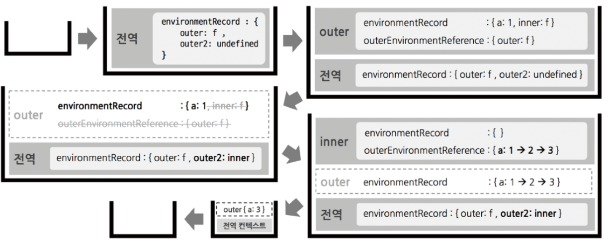

# Short ver

## 클로저 정의

- ‘내부 함수와 LexicalEnvironment의 조합에서 나타나는 특별한 현상’
- ex) 실행컨텍스트 A에서 함수 B를 선언<br> ⇒ A의 LexicalEnvironment와 함수 B의 조합에서 나타나는 특별한 현상
- 위 A와 B의 관련성은 A의 **environmentRecord**와 B의 **outerEnvironmentReference**
- **컨텍스트 A**에서 선언한 **변수**를 **내부함수 B**에서 **참조**할 경우 발생하는 특별한 현상
- **어떤 함수 A**(컨텍스트 A)**에서** 선언한 **변수 a**를 **참조**하는 **내부함수 B**를 A의 외부로 전달할 경우, **A**가 종료된 이후에도 **a**가 **사라지지 않는** 현상

## 클로저가 가지는 이점

```jsx
//user함수 실행컨텍스트가 종료되면서 _name변수가 사라져야하는데
//return에서 해당 변수를 사용하는 함수가 있으니까(참조 카운트가 0이 아님)
// 나중에 쓸 변수라고 판단하고 살려둠
function user(_name) {
  var _logged = true;
  return {
    get name() { return _name; },
    set name(v) { _name = v; },
    login() { _logged = true; },
    logout() { _logged = false; },
    get status() {
      return _logged ? "login" : "logout";
    },
  };
}
var roy = user("재남");
console.log(roy.name); //재남

roy.name = "제이";
console.log(roy.name); // 제이

roy._name = "로이";
console.log(roy.name); //제이

console.log(roy.status); // login

roy.logout();
console.log(roy.status); // logout

roy.status = true;      // setter가 없고 getter밖에 없으므로 보호
console.log(roy.status); // logout
```

1. **함수 종료 후에도 사라지지 않는 값을 유지하는 변수를 만들 수 있다.**
    1. `_name`과`_logged`는 함수 종료 후에도 사라지지 않음
2. **외부로부터 내부 변수 보호(캡슐화)**
    1. 외부에 노출된 `status`프로퍼티는 getter로서 역할만 하고 실제 `_logged`값과는 별개의 문자열 만을 반환
    2. 실제 `_logged`값에 변화를 주는 건 `login`과 `logout`메서드에 의해서만 가능하다.

# 클로저

## 1. 클로저의 의미 및 원리 이해

- 클로저란 “어떤 함수에서 선언한 변수를 참조하는 내부함수에서만 발생하는 현상”
- 예제1. 외부 함수의 변수를 참조하는 내부 함수

    ```jsx
    //outer 컨텍스트에서 선언한 변수 a를 내부 함수 inner에서 참조
    var outer = function(){
     var a = 1;
     var inner = function(){
      console.log(++a); // 2
     }
     inner();
    };
    outer();
    ```

- 예제2. 외부 함수의 변수를 참조하는 내부 함수

    ```jsx
    var outer = function(){
     var a = 1;
     var inner = function(){
      return ++a;
     }
     return inner();
    };
    var outer2 = outer();
    console.log(outer2);  //2
    ```

- 예제1과 2 모두 `outer`함수 실행 컨텍스트 종료 이전에 `inner` 함수 실행컨텍스트 종료, 이후 `inner` 함수 호출 불가
- **예제3. 외부 함수의 변수를 참조하는 내부 함수**

    ```jsx
    var outer = function(){
     var a = 1;
     var inner = function(){
      return ++a;
     }
     return inner;
    };
    var outer2 = outer();
    console.log(outer2());  //2
    console.log(outer2());  //3
    ```

    

- “어떤 함수에서 선언한 변수를 참조하는 내부함수에서만 발생하는 현상”
<br>
⇒ "외부 함수의 LexicalEnvironment가 가비지 컬렉팅 되지 않는 현상”
<br>
⇒ **“어떤 함수 A에서 선언한 변수 a를 참조하는 내부함수 B를 외부로 전달할 경우, A의 실행 컨텍스트가 종료된 이후에도 변수 a가 사라지지 않는 현상”**
- 예제4. return 없이도 클로저가 발생하는 다양한 경우
  - 별도의 외부 객체 window의 메서드 (`setInterval`또는 `setTimeout`)에 전달할 콜백 함수 내부에서 지역변수 a를 참조한다.

      ```jsx
        // (1) setInterval/setTimeout
        (function () {
          var a = 0;
          var intervalid = null;
          var inner = function () {
            if (++a >= 10) {
              clearInterval(intervalid);
            }
            console.log(a);
          };
          intervalid = setInterval(inner, 1000);
        })();
        ```

  - 별도의 외부 객체 DOM의 메서드(`addEventListener`)에 등록할 handler 함수 내부에서 지역변수 `count`를 참조한다.

      ```jsx
        // (2) eventListener
        (function () {
          var count = 0;
          var button = document.createElement("button");
          button.innerText = "click";
          button.addEventListener('click', function(){
            console.log(++count, 'times clicked');
          })
          document.body.appendChild(button);
        })();
        ```

## 2. 클로저와 메모리 관리

- 보통 ‘메모리 누수’라는 표현은 개발자 의도와 달리 어떤 값의 참조 카운트가 0이 되지 않아 GC(Garbage Collector)의 수거 대상이 되지 않는 경우
- 따라서, 의도적으로 참조 카운트를 0이 되지 않게 설계한 경우는 ‘누수’가 아님
- 최근 JS엔진에서는 과거 엔진에서 의도치 않게 누수가 발생하는 여러 상황(순환 참조, 이벤트 핸들러)이 발생하지 않거나 발견하기 힘듦.
  - cf. 순환 참조
    - 함수 호출이 완료되면 이 두 객체는 스코프를 벗어나게 될 것이며, 그 시점에서 두 객체는 불필요해지므로 할당된 메모리는 회수되어야 함. 그러나 두 객체가 서로를 참조하고 있으므로, 예전에는 둘 다 가비지 컬렉션의 대상으로 표시하지 않았음.

        ```jsx
            
            function f() {
              var x = {};
              var y = {};
              x.a = y;         // x는 y를 참조합니다.
              y.a = x;         // y는 x를 참조합니다.
            
              return "azerty";
            }
            
            f();
        ```

- 따라서, **‘메모리 소모’에 대한 관리법만 잘 파악해서 적용하면 충분.**

### **클로저 + 메모리 관리법**

- 참조 카운트를 0으로 만드는 방법 - 식별자에 참조형이 아닌 기본형 데이터(보통 null or undefined) 할당.
- 예제5. 클로저의 메모리 관리

    ```jsx
    //(1) return에 의한 클로저의 메모리 해제
    var outer = (function(){
      var a=1;
      var inner = function (){
        return ++a;
      };
      return inner;
    })();
    console.log(outer());
    console.log(outer());
    outer = null;
    **console.log(outer);   // outer 식별자의 inner 함수 참조를 끊음.**
    ```

    ```jsx
    //(2) setInterval에 의한 클로저의 메모리 해제
    (function (){
      var a=0;
      var intervalid=null;
      var inner = function(){
        if(++a>=10){
          clearInterval(intervalid);
          **inner=null;    // inner 식별자의 함수 참조를 끊음**
        }
        console.log(a);
      };
      intervalid = setInterval(inner, 1000);
    })();
    ```

    ```jsx
    //(3) eventListener에 의한 클로저의 메모리 해제
    (function (){
      var count = 0;
      var button = document.createElement('button');
      button.innerText = 'click';
      
      var clickHandler = function(){
        console.log(++count, 'times clicked');
        if(count >= 10){
          button.removeEventListener('click', clickHandler);
          **clickHandler=null;   // clickHandler 식별자의 함수 참조를 끊음**
        }
      };
      button.addEventListener('click', clickHandler);
      document.body.appendChild(button);
    })();
    ```

## 3. 클로저의 활용 사례

### 3-1 콜백 함수 내부에서 외부 데이터를 사용하고자 할 때

- **콜백 함수를 내부 함수로 선언해서 외부변수를 직접 참조 (클로저)**

    ```jsx
    var fruits =['apple','banana', 'peach'];
    var $ul = document.createElement('ul');
    
    fruits.forEach(function(fruit){   // (A)
      var $li = document.createElement('li');
      $li.innerText = fruit;
      $li.addEventListener('click', function () { // (B)
        alert('your choice is '+ fruit);
      });
      $ul.appendChild($li);
    })
    
    document.body.appendChild($ul);
    ```

- **`bind` 메서드로 값을 직접 넘겨주고 함수 외부로 분리 (클로저x)**

    ```jsx
    var fruits =['apple','banana', 'peach'];
    var $ul = document.createElement('ul');
    
    var alertFruit = function(fruit){
      alert('your choice is '+ fruit);
    }
    
    fruits.forEach(function(fruit){
      var $li = document.createElement('li');
      $li.innerText = fruit;
      $li.addEventListener('click', alertFruit.bind(null, fruit));
      $ul.appendChild($li);
    })
    
    document.body.appendChild($ul);
    alertFruit(fruits[1]);
    ```

- **고차함수 활용 (클로저)**

    cf. **고차함수** : 함수를 인자로 받거나 함수를 리턴하는 함수

- `alertFruitBuilder` 안에서 기존의 `alertFruit` 함수를 익명함수로 반환. `alertFruitBuilder`
 함수가 실행하면 이 함수의 실행 결과가 다시 함수가 되며 반환된 함수를 리스너에 콜백 함수로써 전달한다. 이후 언젠가 클릭 이벤트가 발생하면 이 함수의 실행 컨텍스트가 열리면  `alertFruitBuilder`의 인자로 넘어온 `fruit`를 `outerEnvironmnetReference`에 의해 참조할 수 있게 된다.

    ```jsx
    var fruits =['apple','banana', 'peach'];
    var $ul = document.createElement('ul');
    
    var alertFruitBuilder = function(fruit){
     return function(){
       alert('your choice is '+ fruit);
     }
    }
    
    fruits.forEach(function(fruit){
      var $li = document.createElement('li');
      $li.innerText = fruit;
      $li.addEventListener('click', alertFruitBuilder(fruit));
      $ul.appendChild($li);
    })
    
    document.body.appendChild($ul);
    ```

### 3-2 접근 권한 제어(정보 은닉)

- **정보 은닉(information hiding)**
어떤 모듈의 내부 로직에 대해 외부로의 노출을 최소화해서 모듈간의 결합도를 낮추고 유연성을 높이고자 하는 현대 프로그래밍 언어의 중요한 개념 중 하나.
- 보통 접근 권한에는 public, private, protected의 세 종류. But, **자바스크립트에는 변수에 접근권한 직접부여하도록 설계 x = > 클로저를 이용**.
- 클로저를 이용하면 함수 차원에서 `public`한 값과 `private`한 값을 구분하는 것이 가능하다. `**return**`을 활용하여 외부 스코프에서 함수 내부 변수들 중 선택적으로 일부 변수에 대한 접근 권한 부여.

    ```jsx
    var createCar = function () {
      var fuel = Math.ceil(Math.random() * 10 + 10);
      var power = Math.ceil(Math.random() * 3 + 2);
      var moved = 0;
      var publicMembers = {
        get moved() {
          return moved;
        },
        run: function () {
          var km = Math.ceil(Math.random() * 6);
          var wasteFuel = km / power;
          if (fuel < wasteFuel) {
            console.log("이동불가");
            return;
          }
          fuel -= wasteFuel;
          moved += km;
          console.log(km + "km 이동 (총 " + moved + "km), 남은 연료: " + fuel);
        },
      };
      Object.freeze(publicMembers);
      return publicMembers;
    };
    var car = createCar();
    car.run();
    console.log(car.moved);
    console.log(car.fuel);
    console.log(car.power);
    
    console.log("=====================")
    car.fuel = 1000;
    console.log(car.fuel);
    car.run();
    console.log("=====================")
    car.power = 100;
    console.log(car.power);
    car.run();
    console.log("=====================")
    car.moved = 1000;
    console.log(car.moved);
    car.run();
    ```

- **클로저를 활용한 접근권한 제어 방법 정리**
  - 함수에서 지역변수 및 내부함수 등을 생성한다.
  - 외부에 접근권한을 주고자 하는 대상들로 구성된 참조형 데이터(대상이 여럿일 때는 객체 또는 배열, 하나일 때는 함수)를 `return`한다.
    ⇒ return한 변수들은 공개 멤버, 그 외 변수들은 비공개 멤버.

### 3-3 부분 적용 함수

- **부분 적용 함수(partially applied function)** : n개의 인자를 받는 함수에 미리 m개의 인자만 넘겨 기억 시켰다가, 나중에 (n-m)개의 인자를 넘기면 비로소 원래 함수의 실행 결과를 얻을 수 있게끔 하는 함수이다.

    ```jsx
    var partial = function(){
      var originalPartialArgs = arguments;
      var func = originalPartialArgs[0];
      if(typeof func !== 'function'){
         throw new Error('첫 번째 인자가 함수가 아닙니다.');
      }
      return function(){
        var partialArgs = Array.prototype.slice.call(originalPartialArgs, 1);
        var restArgs =  Array.prototype.slice.call(arguments); 
        return func.apply(this, partialArgs.concat(restArgs));
      };
    };
    
    var add = function() {
     var result = 0;
       for (var i = 0; i < arguments.length; i++){
         result += arguments[i];
        }
     return result;
    }
    
    var addPartial = partial(add, 1,2,3,4,5);
    console.log(addPartial(6,7,8,9,10)); //55출력
    
    var dog = {
     name: '멍멍이',
       greet: partial(function(prefix, suffix) {
         return prefix + this.name + suffix;
        }, '왈왈, ')
    }
    
    dog.greet('입니다!'); //왈왈, 강아지 입니다!
    ```

- **디바운스**
  - 짧은 시간 동안 동일한 이벤트가 발생할 경우 전부 처리하지 않고, 처음 또는 마지막에 발생한 이벤트에 대해 한 번만 처리하는 것
  - 프론트엔드 성능 최적화에 큰 도움을 주는 기능입니다. ex) scroll, wheel, mousemove, resize 등에 적용하기 좋음.

    ```jsx
    var debounce = function (**eventName**, **func, wait**) {
      **var timeoutId = null;**
      return function (event) {
        var self = this;
        console.log(eventName, "event 발생");
        clearTimeout(timeoutId);
        timeoutId = setTimeout(func.bind(self, event), wait);
      };
    };
    var moveHandler = function (e) {
      console.log("move event 처리");
    };
    var wheelHandler = function (e) {
      console.log("wheel event 처리");
    };
    
    document.body.addEventListener("mousemove", debounce("move", moveHandler, 500));
    document.body.addEventListener(
      "mousewheel",
      debounce("wheel", wheelHandler, 700)
    );
    ```

### 3-4 커링 함수(currying function)

- 여러개의 인자를 받는 함수를 하나의 인자만 받는 함수로 나눠서 순차적으로 호출될 수 있게 체인 형태로 구성한 것. 한번에 하나의 인자만 전달하는 것을 원칙.

    ```jsx
    var curry3 = function (func) {
      return function (a) {
        return function (b) {
          return func(a, b);
        };
      };
    };
    
    var getMaxWith10 = curry3(Math.max)(10);
    console.log(getMaxWith10(8)); // 10
    console.log(getMaxWith10(25)); // 25
    
    var getMaxWith10 = curry3(Math.min)(10);
    console.log(getMaxWith10(8)); // 8
    console.log(getMaxWith10(25)); // 10
    ```

- 필요한 인자의 개수만큼 함수를 만들어 계속 리턴해주다가 마지막에 조합해서 리턴한다. 다만 이자가 많아질수록 가독성이 떨어진다는 단점이 있다.

    ```jsx
    var curry5 = function (func) {
      return function (a) {
        return function (b) {
          return function (c) {
            return function (d) {
              return function (e) {
                return func(a, b, c, d, e);
              };
            };
          };
        };
      };
    };
    
    var getMax = curry5(Math.max);
    console.log(getMax(1)(2)(3)(4)(5));
    ```

- ES6에서는 화살표 함수를 써서 간단하게 표기할 수 있다

    ```jsx
    var curry5 = func => a => b => c => d => e => func(a, b, c, d, e);
    ```

- 커링 함수는 **지연 실행(lazy execution)**에 유용하게 사용됨.
지연 실행 - 당장 필요한 정보만 받아서 전달하고, 또 필요한 정보가 들어오면 전달하는 식으로 결국 마지막 인자가 넘어갈 때까지 함수 실행을 미루는 것을 의미.
프로젝트 내에서 자주 쓰이는 함수의 매개변수가 항상 비슷하고 일부만 바뀌는 경우에도 적절.

    ```jsx
    //ES6 이전
    var getInformation = function (baseUrl) {  // 서버에 요청할 주소 기본 URL
      return function (path) {                 // path값
        return function (id) {                 // id 값
          return fetch(baseUrl + path + "/" + id); //실제 서버에 정보 요청
        };
      };
    };
    //ES6
    var getInformation = (baseUrl) => (path) => (id) => fetch(baseUrl + path + "/" + id);
    ```

    ```jsx
    //==== 위 함수 활용 예시
    var productUrl = 'http://productAddress.com/';
    
    // 제품타입별 요청 함수 준비
    var getProduct = getInformation(productUrl); //http://productAddress.com/
    var getFruit = getProduct('fruit');          //http://productAddress.com/fruit
    var getVegetable = getProduct('vegetable');  //http://productAddress.com/vegetable
    
    //실제 요청
    var fruit1 = getFruit(300);               // http://productAddress.com/fruit/300
    var fruit2 = getFruit(400);               // http://productAddress.com/fruit/400
    ```

- 여러 프레임워크, 라이브러리에서 광범위하게 사용됨.
ex) Flux 아키텍처 구현체 Redux의 미들웨어 예시

    ```jsx
    //Redux Middleware 'Logger'
    const logger = store => next => action => {
      console.log('dispatching', action);
      console.log('next state', store.getState());
      return next(action);
    }
    //Redux Middleware 'thunk'
    const thunk = store => next => action => {
      return typeof action === 'function'
        ? action(dispatch, store.getState)
        : next(action);
    }
    ```

## 4. 정리

- 클로저란 어떤 함수에서 선언한 변수를 참조하는 내부함수를 외부로 전달할 경우, 함수의 실행 컨텍스트가 종료된 후에도 해당 변수가 사라지지 않는 현상.
- 내부함수를 외부로 전달하는 방법에는 함수 return하는 경우 뿐만 아니라 콜백으로 전달하는 경우도 포함됨.
- 클로저는 그 본질이 메모리를 계속 차지하는 개념이므로 더는 사용하지 않게 된 클로저에 대해서 메모리 관리를 해줄 필요가 있음
