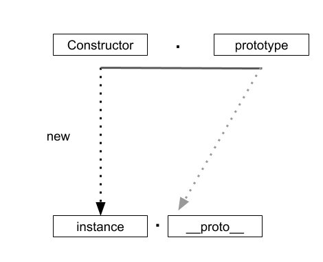
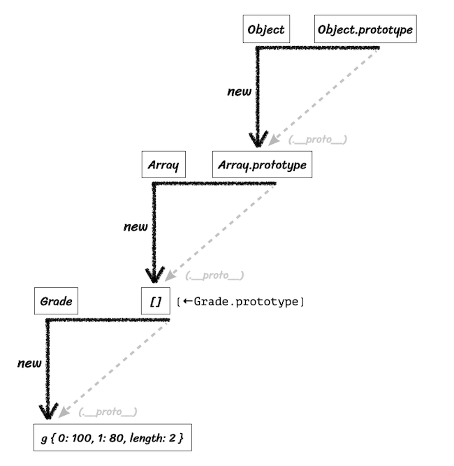

# Short ver

## 프로토타입

## 1. prototype / [[Prototype]] / constructor

  

### **프로토타입의 모든 것**

> **new 연산자로 Constructor를 호출하면 instance가 만들어지는데, 이 instance의 생략가능한 프로퍼티인 __proto__는 Constructor로 정의한 prototype을 참조한다.**
>

`instance.__proto__` == **`Object.getPrototypeOf(instance)`**

```jsx
function Person(n, a){
 this.name = n;
 this.age = a;
}
var roy = new Person('로이', 30);

var royClone1 = new **roy.__proto__**.constructor('로이_클론1', 10);

var royClone2 = new **roy**.constructor('로이_클론2', 25);

var royClone3 = new **Object.getPrototypeOf(roy)**.constructor('로이_클론3', 20);

var royClone4 = new **Person.prototype**.constructor('로이_클론4', 15);
```

- 생성자함수의 동일한 객체(prototype)에 접근 가능
  - instance.**proto**
  - instance
  - Object.getPrototypeOf(instance)
  - Constructor.prototype

- 생성자 함수 접근 가능
  - Constructor
  - instance.**proto**.constructor
  - instance.constructor
  - (Object.getPrototypeOf(instance)).constructor
  - Constructor.prototype.constructor

## 2. 메소드 상속 및 동작 원리

- DIY(Do It Yourself) ⇒ DRY(Don’t Repeat Yourself), 매번 직접 반복하지 말고 반복을 줄여라
- 인스턴스들이 모두 똑같이 가지는 정보들을 prototype으로 보내면 된다.
=> 1.메모리 용량 최적화
=> 2.객체지향적인 특징 - 특정 집단의 공통된 속성 파악

```jsx
//수정전
function Person(n, a){
 this.name=n;
 this.age = a;
}

var roy = new Person('로이',30);
var jay = new Person('제이',25);

**roy.setOlder = function(){
 this.age +=1;
}
roy.getAge = function(){
 return this.age;
}

jay.setOlder = function(){
 this.age +=1;
}
jay.getAge = function(){
 return this.age;
}**
```

```jsx
//수정후
function Person(n, a){
 this.name=n;
 this.age = a;
}

**Person.prototype.setOlder = function(){
 this.age +=1;
}
Person.prototype.getAge = function(){
 return this.age;
}**

var roy = new Person('로이',30);
var jay = new Person('제이',25);
```

## 3. Prototype Chaining

  

- 인스턴스에는 특정 메서드가 없음에도 불구하고 [[Prototype]] 이라는 매개체 덕분에 생성자 함수의 prototype에 있는 메서드를 자신의 것처럼 쓸 수 있다.
- 프로토타입 체인 - [[Prototype]]으로 이어진 각 prototype들에 모두 접근할 수 있음

# ******************Long ver.******************

## 프로토타입 개념과 이해

### constructor, prototype, instance

  

```jsx
var instance = new Constructor();
```

- 어떤 생성자 함수(Constructor)를 new 연산자와 함께 호출하면
- Constructor에서 정의된 내용을 바탕으로 새로운 인스턴스가 생성된다.
- 이때 instance에는 `__proto__` 라는 프로퍼티가 자동을 부여되는데
- 이 프로퍼티는 Constructor의 prototype라는 프로퍼티를 참조한다.

- prototype은 객체. 이를 참조하는 **proto** 또한 객체. prototype 객체 내부에는 인스턴스가 사용할 메서드를 저장하면 인스턴스에서도 숨겨진 프로퍼티인 __proto__를 통해 이 메서드들에 접근할 수 있음

    ```jsx
    let Person = function(name) {
      this.name = name;
    };
    Person.prototype.getName = function() {
      return this._name;
    };
    ```

- 아래와 같이 Person의 인스턴스는 proto 프로퍼티로 getName을 호출할 수 있다. `undefined`가 출력되는 이유는 함수를 메서드로서 호출하면 바로 앞의 객체가 곧 `this`가 되기 때문이다. `__proto__` 객체에는 name 프로터티가 없기 때문에 `undefined`가 반환된다.

    ```jsx
    let suzi = new Person('Suzi');
    suzi.__proto__.getName(); // undefined
    
    Person.prototype === suzi.__proto__ // true
    ```

- this를 인스턴스로 사용하고 싶다면 `__proto__`를 생략하면 된다. 원래부터 생략 가능하도록 정의되어있다. 이런 점 때문에 **생성자 함수의 prototype에 어떤 메서드나 프로퍼티가 있다면 인스턴스에서도 마치 자신의 것처럼 해당 메서드나 프로퍼티에 접근할 수 있게 된다.**

    ```jsx
    suzi.__proto__.getName
    => suzi(.__proto__).getName
    => suzi.getName
    ```

- 한편 prototype 프로퍼티 내부에 있지 않은 메서드들은 인스턴스가 직접 호출할 수 없기 때문에 생성자 함수에서 직접 접근해야 실행이 가능하다.

    ```jsx
    let arr = [1, 2];
    arr.forEach(function() {}); // (0)
    Array.isArray(arr); // (0) true
    arr.isArray(); // (x) TypeError: arr.isArray is not a function
    ```

### constructor 프로퍼티

- 생성자 함수의 프로퍼티인 Prototype 내부에는 consturctor라는 프로퍼티가 있다. 인스턴스의 `__proto__` 객체에도 마찬가지이다. 원래의 **생성자 함수(자기 자신)을 참조**하는데, 인스턴스로부터 그 원형을 알 수 있는 수단이기 때문이다.

    ```jsx
    let arr = [1, 2];
    Array.prototype.constructor == Array // true
    arr.__proto__.constructor == Array // true
    arr.constructor == Array // true
    
    let arr2 = new arr.constructor(3, 4);
    console.log(arr2); // [3, 4]
    ```

- constructor는 읽기 전용 속성(기본형 리터럴 변수 - number, string, boolean)이 부여된 예외적인 경우를 제외하고는 값을 바꿀 수 있다.

    ```jsx
    let NewConstructor = function() {
      console.log('this is new constructor!');
    };
    let dataTypes = [
      1, // Number & false
      'test', // String & false
      true, // Boolean & false
      {}, // NewConstructor & false
      [], // NewConstructor & false
      function () {}, // NewConstructor & false
      /test/, // NewConstructor & false
      new Number(), // NewConstructor & false
      new String(), // NewConstructor & false
      new Boolean, // NewConstructor & false
      new Object(), // NewConstructor & false
      new Array(), // NewConstructor & false
      new Function(), // NewConstructor & false
      new RegExp(), // NewConstructor & false
      new Date(), // NewConstructor & false
      new Error() // NewConstructor & false
    ];
    
    dataTypes.forEach(function(d) {
      d.constructor = NewConstructor;
      console.log(d.constructor.name, '&', d instanceof NewConstructor);
    });
    ```

- 모든 데이터가 `d instanceof NewConstructor` 명령어에 대해 false를 반환하는데, constructor를 변경하더라도 참조하는 대상이 변경될 뿐 **이미 만들어진 인스턴스의 원형이 바뀐다거나 데이터 타입이 변하는 것은 아님**을 알 수 있다. 어떤 인스턴스의 생성자 정보를 알아내기 위해 constructor 프로퍼티에 의존하는 것이 항상 안전하지는 않다는 것을 알 수 있다.

- 다음 각 줄은 모두 동일한 대상을 가르킨다.

    ```jsx
    [Constructor]
    [instance].__proto__.constructor
    [instance].constructor
    Object.getPrototypeOf([instance]).constructor
    [Constructor].prototype.constructor
    ```

- 다음 각 줄은 모두 동일한 객체에 접근할 수 있다.

    ```jsx
    [constructor].prototype
    [instance].__proto__
    [instance]
    Object.getPrototypeOf([instance])
    ```

## 프로토타입 체인

### 메서드 오버라이드

- 인스턴스가 동일한 이름의 프로퍼티나 메소드를 가지게 되면 **메소드 오버라이드**가 일어난다.
- 자바스크립트 엔진이 getName 메소드를 찾는 방식은, 가장 가까운 대상인 자신의 프로퍼티를 검색하고, 없으면 다음으로 가까운 대상인 `__proto__`를 검색하는 순서로 진행된다. 즉 순서가 밀리기 때문에 `__proto__`의 메소드가 노출되지 않는 것이다.

    ```jsx
    let Person = function(name) {
      this.name = name;
    };
    Person.prototype.getName = function() {
      return this.name;
    };
    
    let iu = new Person('지금');
    iu.getName = function() {
      return '바로 ' + this.name;
    };
    console.log(iu.getName()); // 바로 지금
    ```

- 일반적으로 메서드가 오버라이드된 경우에, 자신으로 부터 가장 가까운 메서드에 접근하지만, 그 다음으로 가까운 `__proto__` 의 메서드도 `call`이나 `apply`로(this 바인딩 시켜줘서) 우회적 접근이 가능함.

    ```jsx
    console.log(iu.__proto__.getName.call(iu));
    ```

---

## 프로토타입 체인

- **프로토타입 체인(prototype chain)**: 어떤 데이터의 `__proto__` 프로퍼티 내부에 다시 `__proto__`프로퍼티가 연쇄적으로 이어진 것.
- **프로토타입 체이닝(prototype chaining)**: 프로토타입 체인을 따라가며 검색하는 것.

    ```jsx
    let arr = [1, 2];
    arr(.__proto__).push(3);
    arr(.__proto__)(.__proto__).hasOwnProperty(2); // true 
    // arr.__proto__(Array.prototype 참조)의 __proto__(Object.prototye 참조) 
    ```

### 객체 한정 메서드

- 객체 한정 메서드들은 Object.prototype이 여타 참조형 데이터뿐 아니라 기본형 데이터조차 __proto__에 반복 접근함으로써 도달할 수 있는 최상위 존재이기 때문에 Object.prototype이 아닌 Object에 직접 부여할 수 밖에 없었다.
- 반대로 Object.prototype에는 어떤 데이터에서도 활용할 수 있는 범용적 메서드들이 있다(toString, hasOwnProperty, valueOf, isPrototypeOf 등).

### 다중 프로토타입 체인

- 대각선의 `__proto__`를 연결해 나가기만 하면 무한대로 체인 관계를 만들 수 있는데, 이 방식으로 다른 언어의 **클래스**와 비슷하게 동작하는 구조를 만들 수 있다.
- 대각선의 `__proto__`를 연결하는 방법은 `__proto__`가 가리키는 대상, 즉 생성자 함수의 prototype이 연결하고자 하는 상위 생성자 함수의 인스턴스를 바라보게끔 해주면 된다.

    ```jsx
    let Grade = function() {
      let args = Array.prototype.slice.call(arguments);
      for(let i = 0; i < args.length; i++) {
        this[i] = args[i];
      }
      this.length = args.length;
    };
    let g = new Grade(100, 80);
    ```

- 변수 g는 Grade의 인스턴스를 바라본다. Grade의 인스턴스는 여러 개의 인자를 받아 각각 순서대로 인덱싱하여 저장하고 length 프로퍼티가 존재하는 등 배열의 형태를 지니지만 배열 메서드를 사용할 수 없는 유사배열객체이다. 이 인스턴스에서 배열 메소드를 직접 쓸 수 있게끔 하고 싶다면 `g.__proto__`, 즉 Grade.prototype이 배열의 인스턴스를 바라보게 하면 된다.

    ```jsx
    Grade.prototype = [];
    ```

- 이렇게 g 인스턴스는 프로토타입 체인에 따라 g 객체 자신이 지니는 멤버, Grade의 prototype에 있는 멤버, Array.prototype에 있는 멤버, 끝으로 Object.prototype에 있는 멤버에까지 모두 접근할 수 있게 된다.

    ```jsx
    console.log(g); // Grade(2) [100, 80]
    g.pop()
    console.log(g) // Grade(1) [100]
    g.push(90)
    console.log(g) // Grade(2) [100, 90]
    
    ```

### 정리

- 어떤 생성자 함수를 new 연산자와 함께 호출하면 Constructor에서 정의된 내용을 바탕으로 새로운 인스턴스가 생성되다.
- 이 인스턴스에는 **proto** 라는, Constructor의 prototype 프로퍼티를 참조하는 프로퍼티가 자동으로 부여된다.
- __proto__는 생략 가능한 속성이라서, 인스턴스는 Constructor.prototype의 메서드를 자신의 메서드인 것처럼 호출 가능하다.

- Constructor.prototype에는 constructor라는 프로퍼티가 있는데, 이는 다시 생성자 함수 자신을 가리킨다. 이 프로퍼티는 인스턴스가 자신의 생성자 함수가 무엇인지 알고자 할 때 필요한 수단

- 직각삼각형 대각선 방향 즉, **proto** 방향을 계속 찾아가면 최종적으로 Object.prototype에 당도한다. 이렇게 __proto__안에 다시 __proto__를 찾아가는 과정을 **프로토타입 체이닝이라한다.**
- 이 프로토 타입 체이닝을 통해 각 프로토타입 메서드를 자신의 것처럼 호출 가능하다.
- 이때, 접근 방식은 가장 가까운 대상부터 점차 먼 대상으로 나아가며, 원하는 값 찾을 시 검색을 중단한다.

- Object.prototye에는 모든 데이터 타입에서 사용 가능한 범용적인 메서드만이 존재
- 객체 전용 메서드는 여느 데이터 타입과 달리 Object 생성자 함수에 스태틱하게 담겨있다.

- 프로토타입 체인은 반드시 2단계로만 이루어진 것이아니라 무한대 단계를 생성 가능하다.

# 출처

- [정재남 - 코어 자바스크립트 인프런 강의](https://www.inflearn.com/course/%ED%95%B5%EC%8B%AC%EA%B0%9C%EB%85%90-javascript-flow)
- 정재남, 『코어 자바스크립트』, 위키북스(2019).
