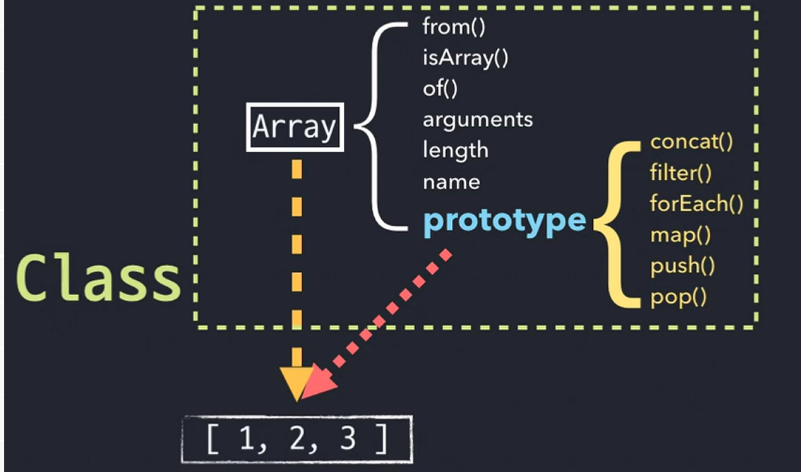

# Short ver

## Class

<figure>

</figure>

**인스턴스,** 어떤 공통적인 특성들을 가진 구체적인 대상

**클래스,** 이 인스턴스들의 공통적인 속성

**superclass,** 클래스의 상위 클래스

**subclass,** 클래스의 하위 클래스

### 자바스크립트의 클래스

<figure>

</figure>

**클래스**는 어떤 공통된 속성이나 기능을 정의한 추상적인 개념, **인스턴스**는 이 클래스 속한 객체

클래스에는 인스턴스에서는 직접 접근 할 수 없는, 클래스 자체에서만 접근 가능한 스태틱 멤버와 인스턴스에서 직접 활용할 수 있는 프로토타입 메서드가 있음

위 그림에서 Array에는 **static methods, static properties라고 하며,** 클래스를 추상적인 클래스로서가 아니라 클래스를 **하나의 객체로서 다룰 때 쓰는 메서드**

**prototype에 있는 메서드는** **(프로토타입) 메서드**

<figure>

</figure>

인스턴스에서 직접 접근 가능한지 여부

```jsx
var Rectangle = function (width, height) {
  this.width = width;
  this.height = height;
};

Rectangle.prototype.getArea = function () {
  // 프로토타입 메서드
  return this.width * this.height;
};

Rectangle.isRectangle = function (instance) {
  //스태틱 메서드
  return (
    instance instanceof Rectangle && instance.width > 0 && instance.height > 0
  );
};

var rect1 = new Ractangle(3, 4);
console.log(rect1.getArea()); // 12
console.log(rect1.isRectangle(rect1)); // Error
console.log(Rectangle.isRectangle(rect1)); // true
```

this 사용시, 인스턴스에서 methods는 **proto**로 접근가능.

하지만, **instance에서 static methods & static properties로 접근 불가**

instance를 this로서 접근을 못 하지만, 접근을 하려면 call이나 apply, bind 같은 메서드 사용.

---

## Class Inheritance

- ES6부터 class 문법이 도입되었지만, ES5까지는 아래와 같은 방식들로, 객체 지향 언어에 익숙한 개발자들에게 클래스 상속을 최대한 친숙한 형태로 흉내내는 것이 주 관심사 였다.
- 클래스 상속 구현 == 프로토타입 체이닝을 잘 연결하는 것

Person과 Employee 생성자 함수에서 getName, getAge가 **중복**

따라서, Person을 상위에, Employee를 하위로 내려 **상속 구조**를 만들 수 있음

<figure>

</figure>

상속 구조를 다음과 같이 만들면, Person은 getName과 getAge에 접근이 가능하지만, getPosition에는 접근하지 못하며, Employee는 3개 메서드에 접근 가능

<figure>

</figure>

<figure>

</figure>

### 클래스 상속을 흉내 내기 위한 3가지 방법

1. SubClass.prototype에 SuperClass의 인스턴스를 할당한 다음 프로퍼티를 모두 삭제하는 방법

   ```jsx
   function Person(name, age) {
     this.name = name;
     this.age = age;
   }

   Person.prototype.getName = function () {
     return this.name;
   };

   Person.prototype.getAge = function () {
     return this.age;
   };

   function Employee(name, age, position) {
     Person.call(this, name, age);
     this.position = position;
   }

   Employee.prototype = new Person();
   delete Employee.prototype.getName;
   delete Employee.prototype.getAge;

   Employee.prototype.getPosition = function () {
     return this.position;
   };

   var emp = new Employee("John Doe", 30, "Software Developer");

   console.log(emp.getName()); // TypeError: emp.getName is not a function
   console.log(emp.getAge()); // TypeError: emp.getAge is not a function
   console.log(emp.getPosition()); // "Software Developer"
   ```

2. 빈 함수(Bridge)를 활용하는 방법 (더글라스 크락포드가 고안한, 가장 대중적 방법)

<figure>

</figure>

- Bridge라는 빈 함수 생성
- Bridge.prototype이 Person.prototype을 참조하도록 만듦
- Employee.prototype에 Bridge 인스턴스 할당
- Employee.prototype.constructor 다시 살려줌
- Employee.prototype.getPosition 선언

  ```jsx
  function Person(name, age) {
    this.name = name;
    this.age = age;
  }

  Person.prototype.getName = function () {
    return this.name;
  };

  Person.prototype.getAge = function () {
    return this.age;
  };

  function Employee(name, age, position) {
    Person.call(this, name, age);
    this.position = position;
  }

  function Bridge() {}

  Bridge.prototype = Person.prototype;

  Employee.prototype = new Bridge();
  Employee.prototype.constructor = Employee;
  Employee.prototype.getPosition = function () {
    return this.position;
  };

  var emp = new Employee("John Doe", 30, "Software Developer");

  console.log(emp.getName()); // "John Doe"
  console.log(emp.getAge()); // 30
  console.log(emp.getPosition()); // "Software Developer"
  ```

3. Object.create를 이용하는 방법(위 2가지보다 안전한)

   ```jsx
   function Person(name, age) {
     this.name = name;
     this.age = age;
   }

   Person.prototype.getName = function () {
     return this.name;
   };

   Person.prototype.getAge = function () {
     return this.age;
   };

   function Employee(name, age, position) {
     Person.call(this, name, age);
     this.position = position;
   }

   Employee.prototype = Object.create(Person.prototype);
   Employee.prototype.constructor = Employee;
   Employee.prototype.getPosition = function () {
     return this.position;
   };

   var emp = new Employee("John Doe", 30, "Software Developer");

   console.log(emp.getName()); // "John Doe"
   console.log(emp.getAge()); // 30
   console.log(emp.getPosition()); // "Software Developer"
   ```

## ES6 클래스 및 클래스 상속

```jsx
class Animal {
  constructor(name) {
    this.name = name;
  }

  makeSound() {
    console.log("Generic animal sound!");
  }
}

class Dog extends Animal {
  constructor(name, breed) {
    super(name);
    this.breed = breed;
  }

  makeSound() {
    console.log("Bark bark!");
  }

  fetch() {
    console.log("Fetching!");
  }
}

const myDog = new Dog("Fido", "Labrador");
console.log(myDog.name); // "Fido"
console.log(myDog.breed); // "Labrador"
myDog.makeSound(); // "Bark bark!"
myDog.fetch(); // "Fetching!"
```

- 위의 예제는 `Animal` 클래스를 상속하는 `Dog` 클래스를 보여줍니다. `Dog` 클래스는 `name` 속성과 `breed` 속성을 가지며, `makeSound` 메서드를 덮어쓰고, `fetch` 메서드를 추가합니다.
- `Dog` 클래스는 `extends` 키워드를 사용하여 `Animal` 클래스를 상속합니다. `Dog` 클래스의 생성자는 `super` 키워드를 사용하여 `Animal` 클래스의 생성자를 호출합니다.
- `Dog` 클래스의 인스턴스를 만들고 `name`과 `breed` 속성을 확인한 후, `makeSound` 메서드와 `fetch` 메서드를 호출합니다.
- `Dog` 클래스는 `Animal` 클래스에서 상속한 `makeSound` 메서드를 덮어쓰고 `fetch` 메서드를 추가합니다. `Dog` 클래스의 인스턴스를 만들었을 때, `Dog` 클래스의 `makeSound` 메서드와 `fetch` 메서드를 호출할 수 있습니다.

## 정리

- 자바스크립트는 프로토타입 기반 언어라서 클래스 및 상속 개념x
- 하지만, 프로토타입 기반으로 클래스와 비슷하게 동작하게끔 하는 기법들이 도입돼 왔음
- ES6부터는 클래스 문법 도입

**클래스와 인스턴스**

- **클래스** - 어떤 사물의 공통 특성을 모아 정의한 추상적인 개념
- **인스턴스** - 클래스의 속성을 지니는 구체적인 사례
- **상위 클래스**(superclass)의 조건을 충족하면서 더욱 구체적인 조건이 추가된 것을 **하위 클래스**(subclass)라고 함

**메서드**

- **프로토타입 메서드**
  - 클래스의 prototype 내부에 정의된 메서드
  - 인스턴스가 마치 자신의 것처럼 호출할 수 있음
- **스태틱 메서드**
  - 클래스(생성자 함수)에 직접 정의한 메서드
  - 인스턴스가 직접 호출할 수없고 클래스(생성자 함수)에 의해서만 호출할 수 있음

**클래스 상속을 흉내 내기 위한 세가지 방법**

- 아래 세 방법 모두 cunstructor 프로퍼티가 원래 생성자 함수를 바라보도록 조정해야함

1. SubClass.prototype에 SuperClass의 인스턴스를 할당한 다음 프로퍼티를 모두 삭제하는 방법
2. 빈 함수(Bridge)를 활용하는 방법
3. Object.create를 이용하는 방법

# 출처

- [정재남 - 코어 자바스크립트 인프런 강의](https://www.inflearn.com/course/%ED%95%B5%EC%8B%AC%EA%B0%9C%EB%85%90-javascript-flow)
- 정재남, 『코어 자바스크립트』, 위키북스(2019).
