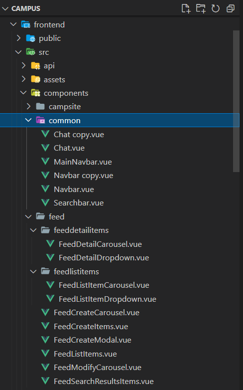
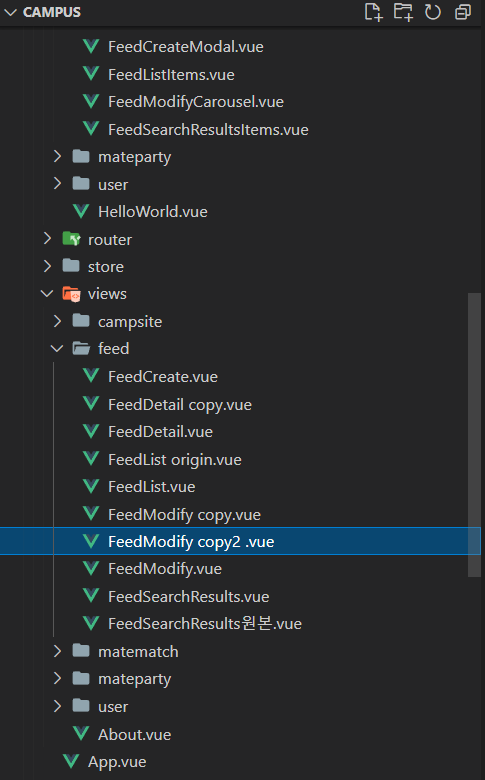
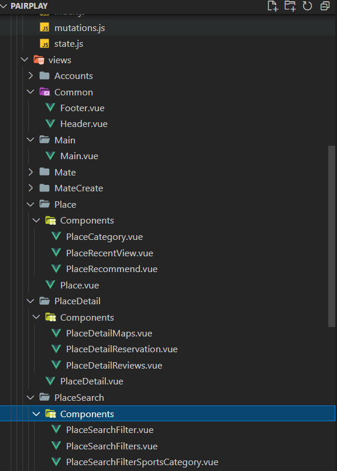

# 프론트엔드에서 Component란?

' Vue.js를 학습하면서 부모, 자식 컴포넌트의 구성을 보며 석사과정에서 원자, 분자, 유기체에 대한 공부를 했던게 순간 떠올랐었는데 정말 이런 패턴이 있다니... 역시 지식은 어느 분야에서도 적용할 수 있기 때문에 학사석사 총합 6년간의 노력이 어디선가 사용할 수 있다는 것을 새삼 느꼈다.'

## Atomic design

아토믹 디자인은 디자인시스템을 만드는 방법론이다. 크게 5가지로 레벨을 구분할 수 있다.

1. [Atoms](https://bradfrost.com/blog/post/atomic-web-design/#atoms)
2. [Molecules](https://bradfrost.com/blog/post/atomic-web-design/#molecules)
3. [Organisms](https://bradfrost.com/blog/post/atomic-web-design/#organisms)
4. [Templates](https://bradfrost.com/blog/post/atomic-web-design/#templates)
5. [Pages](https://bradfrost.com/blog/post/atomic-web-design/#pages)

<figure>
    </img>
</figure>
<address><em>출처</em>: <a href="https://atomicdesign.bradfrost.com/chapter-2/#the-part-and-the-whole"> https://atomicdesign.bradfrost.com/chapter-2/#the-part-and-the-whole </a> </address>

## 컴포넌트 설계에 대한 나의 과거들

프로젝트를 진행하면서 컴포넌트를 어떤 기준으로 나누어야할지 늘 고민이었다. 하지만, 짧은 기간 내 완성을 해야하는 상황이라 깊은 고민을 하지 못한 채 개발을 했었다. 현재, 과거 프로젝트 들의 컴포넌트 구성을 확인해보니 처참하다.

**첫 프로젝트 캠퍼스**에서는 컴포넌트의 재사용성을 고려하지 못했다. 단지, 서비스의 가장 중요한 기능들을 크게 분류하고 가장 최상단(부모) 컴포넌트들은 views에서, 그 안의 자식 컴포넌트들은 components의 해당 기능 폴더에서 정리했다.

**프로젝트 3. 캠퍼스**

<figure style="display:flex;">

</figure>

**프로젝트 1. 페어플레이**

<figure>

</figure>

**가장 최근에 진행했던 Pairplay**에서는 기능 폴더 > 각 페이지 폴더 > 해당 컴포넌트 순으로 정리하였다.

또한 자주 사용되는 푸터나 헤더와 같은 공통 요소들은 common 폴더에 정리하여 다른 팀원들과 함께 사용할 수 있었다.

# Source

https://shop.bradfrost.com/

https://kciter.so/posts/effective-atomic-design

https://fe-developers.kakaoent.com/2022/220505-how-page-part-use-atomic-design-system/

https://www.youtube.com/watch?v=2C1tXVHu9XQ&t=244s
