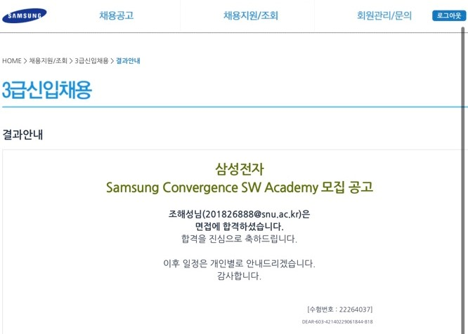
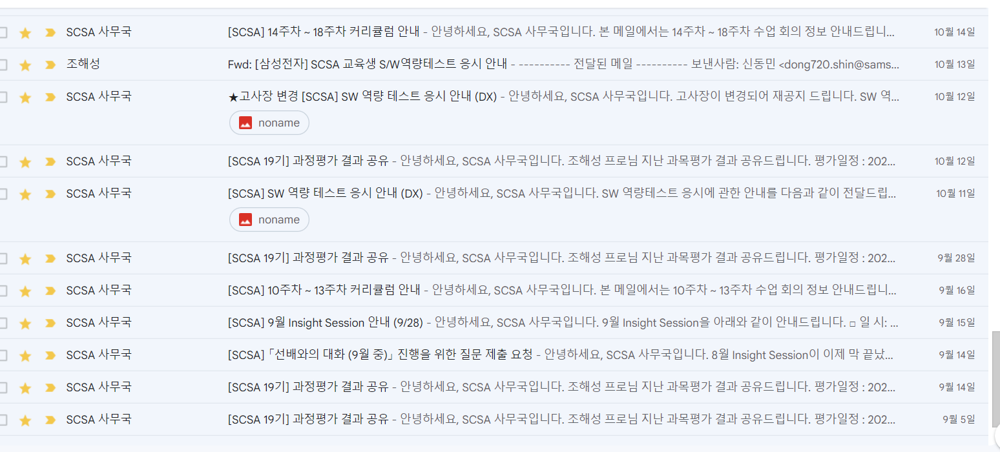
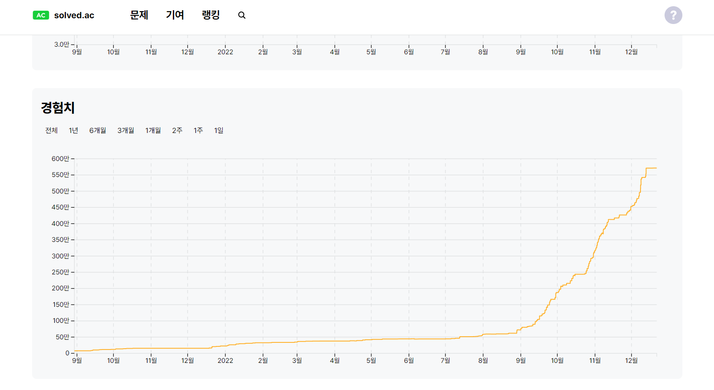

### 삼성전자 SCSA 공채 합격과 실패

**공채 합격 메일**

 

2022년 7월, 삼성전자 DX 사업부로 SCSA 19기에 합격하게 되었다. 욕심을 버리면 좋은 결과가 있다는 말이 참 와닿았던 날이었다. 프론트엔드 개발직무로 취업하는 데 집중하여 GSAT과 면접에 대한 준비를 못 한 상태였지만 평소 습관처럼 삼성에 지원했고 운이 좋게도 최종까지 합격하게 되었다. 그동안 삼성바이오로직스 경영지원팀에 2번의 최종 면접 탈락 경험이 많은 도움이 되었던 것 같다. 
 

합격 발표 후, 가족들과 감격의 눈물을 흘리며 더없이 행복한 시간을 보내고 맛있는 식사를 함께했다. 친구들과도 오랜만에 만나며 맛있는 식사를 대접했다. 한 달에 한번 나가며, 1년간 하루 13 시간 이상씩 앉아 키보드를 두드리던 내 노력의 결실을 맺은 것 같아 너무 행복했다. '삼성만이 나를 알아봐 주는 구나', '더 노력해서 삼성을 위해 이 한 몸 다 바치겠다'라는 생각과 함께 입과 일이 다가오기만을 기다렸다.
 

<figure>

 
</figure>

시간이 흘러, OT가 시작되면서 매주 시험과 SW 역량테스트를 통과하면 완전히 입사된다는 공지를 받게 되었다. 생각지도 못한 얘기에 많은 걱정을 했지만 기존 SCSA 선배들과 여러 게시글을 통해 '조금만 공부하면 되니 걱정하지 말라'는 말들에 한시름 내려놓았다. 하지만, 교육이 시작되면서 SSAFY 때보다 더 어려운 내용들을 학습하기 위해 더 많은 공부량으로 6개월을 보냈다. 고시생처럼 밥 먹고 자는 시간 외에는 공부밖에 하지 않았다. 역량테스트를 대비하기 위해 매일 아침 8시부터 새벽 2시까지 알고리즘을 학습하면서 대략 3개월 ~ 4개월간 400문제 이상의 알고리즘 문제를 해결했다. 알고리즘에 매우 취약해서 백준 기준, 실버 3 수준의 문제도 어려워했었지만, 시간이 지나, 골드 1~2문제도 거뜬히 해결하는 나 자신을 보며 노력을 통해 많이 성장했다는 성취감과 자신감에 시험을 보게 되었다.
 

<figure>

 
</figure>

시험 당일, 기존 기출문제와는 다른 유형과 난이도로 심각하게 당황했다. 문제를 읽고 설계하는 데만 한 시간 이상을 소비했다. 결국, 히든 테스트 케이스를 하나 맞추지 못해 결국 탈락했다. 두 번째 시험까지 한 달간 기출문제를 2~3회 반복 풀고 다양한 문제를 해결하며 더 큰 노력을 기울였다. 하지만, 시험은 많은 학습량으로 자신감이 가득 찼던 나 자신이 후회될 만큼의 문제였다. 결국, 세 번째까지 시험을 치르게 되었지만, 또 테스트 케이스를 다 해결하지 못해 최종 탈락하게 되었다. 6개월간의 교육에 열심히 참여하고 매주 시험을 통과하더라도  역량테스트에 떨어짐으로써 입사가 취소되었다. 1년간 4인치 늘어난 허리와 튀어나온 배를 만지며 '왜 하필 우리 기수부터 프로수준의 유형으로 바뀌고 시험난이도가 이렇게 오른 거야', '이럴 줄 알았으면 시작하지 말고 합격한 기업에 입사할걸' 등의 깊은 패배의 슬픔에 빠져 하루를 보냈다. 하지만 결국, 부족한 내 실력과 노력의 결과라는 사실을 깨닫는 데까지 그리 오래 걸리지 않았다. 

 

이 글을 쓰는 이유는 6개월간 있었던 내 노력의 결과물이 남들이 보기에 비록 불합격했지만 후회되지 않을 만큼의 노력했다는 사실을 잊지 않기 위해서다. 현재 느끼는 이 기분을 매 순간 잊지 않고 후회될 만큼 전문성을 갖추리라 다짐한다. 다시 마음을 가다듬고 취준 개발 블로그를 시작하려 한다.

 
---
