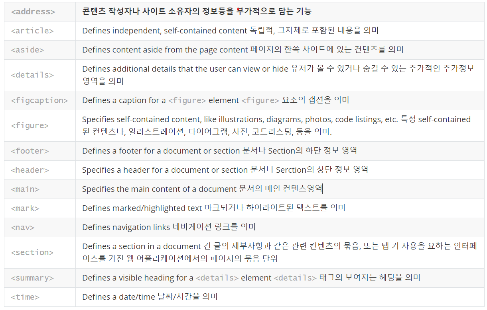

# 시멘틱 태그

모 기업 코딩테스트를 치면서 시멘틱 태그의 중요성을 깨닫게 되었다. 평소 별 생각없이 대부분의 Html태그를 div태그로 사용하고 있었다. 올바른 코드 작성 습관을 알고 있었다면 쉽게 풀 수 있는 문제였다. 오늘은 시멘틱 태그에 대해 학습하고 무한 div태그로 만들어 놓은 내 프로젝트의 코드들을 수정해보려고한다.

<figure style="display:flex;">
 
</figure>

## **What are Semantic Elements?**

시멘틱(Semantic) 요소는 명백하게 브라우저와 개발자들에게 그 의미를 묘사한다.
- **non-semantic** elements: `
` and `` - Tells nothing about its content.
- **semantic** elements: `<form>`, `<table>`, and `<article>` - Clearly defines its content.

  
## **Why Semantic Elements?**

W3C에 따르면 "시맨틱 웹을 사용하면 애플리케이션, 기업 및 커뮤니티에서 데이터를 공유하고 재사용할 수 있다"고 한다. (의미가 있는 요소는 개발자 모두에게 명확한 의미를 전달한다)

### 1. 검색엔진 최적화(search engine optimization, **_SEO_**)
- **검색 엔진이 태그의 목적에 부합하게 설계되어있는 구조의 사이트에서 더욱 빨리 효율적으로 정보를 파악할 수 있어 검색 결과의 노출에 유리할 수 있게 해준다.** 검색엔진이 알맞은 검색결과를 내기 위해 웹사이트를 크롤링할 때, 웹사이트의 내부에 담긴 정보를 기반으로 페이지 내 검색 키워드의 우선순위를 판단하게 된다.
- 유튜브 영상에서 본 바로는 한 페이지에 h1 태그가 하나씩은 반드시 들어가 있는게 좋다고 한다. `<h1>` 태그는 헤드라인을 의미하고, 또 일반적으로 페이지의 내용 중 주제를 파악하기 위해 검색 엔진이 `<h1>`태그를 확인하기 때문이다.
- Ex) image 를 **div**에 background-image 로 붙이는것과 **img** 태그를 쓰는것중 **img** 태그를 쓰는것이 SEO 에게 의미적으로 이미지라는것을 알수있어서 효율적이다.

### 2. **웹 접근성**
- 시각 장애가 있는 사용자가 스크린 리더 및 화면 판독기로 페이지를 탐색할 때 의미론적 마크업을 푯말로 사용할 수 있다.
- 일반적인 브라우저에서는 차이가 없지만 스크린리더(시각장애인을 위한 웹 서핑 프로그램)과 같은 환경에서는 웹 접근성과 사용성을 향상시켜준다.

### 3. 유지보수 및 코드 가독성
- 여러 사람과 함께 작업을 할 때, 굳이 클래스를 지정하지 않아도 쉽게 어느 부분이 헤더 영역이고, 본문 영역인지 쉽게 알 수 있다. 그래서 유지보수를 하기도 쉬워진다.
  </img>
  

---

### 출처

- w3schools [https://www.w3schools.com/html/html5_semantic_elements.asp](https://www.w3schools.com/html/html5_semantic_elements.asp)
- 샐리님의 블로그 [https://m.blog.naver.com/won_1020/221718728799](https://m.blog.naver.com/won_1020/221718728799)
- **[syoung125님의 블로그](https://velog.io/@syoung125)** [https://velog.io/@syoung125/시맨틱-태그-Semantic-Tag-잘-사용하기](https://velog.io/@syoung125/%EC%8B%9C%EB%A7%A8%ED%8B%B1-%ED%83%9C%EA%B7%B8-Semantic-Tag-%EC%9E%98-%EC%82%AC%EC%9A%A9%ED%95%98%EA%B8%B0)
- 주머니세상님의 블로그 [https://jungwoney.tistory.com/3](https://jungwoney.tistory.com/3)
- [삼바의 성장 블로그:티스토리] [https://sambalim.tistory.com/104](https://sambalim.tistory.com/104)
