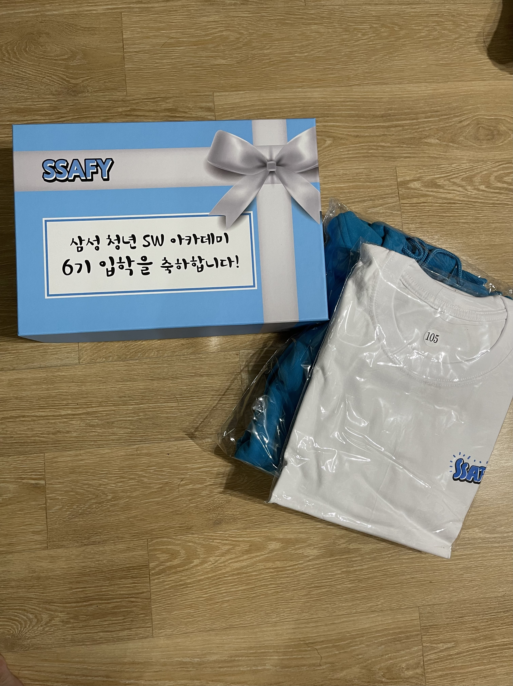
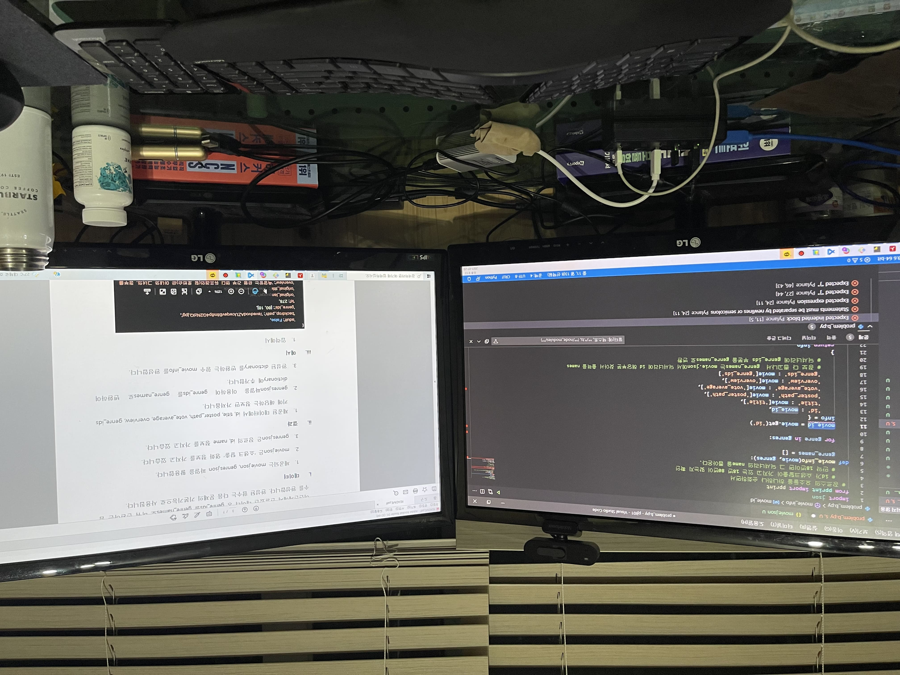
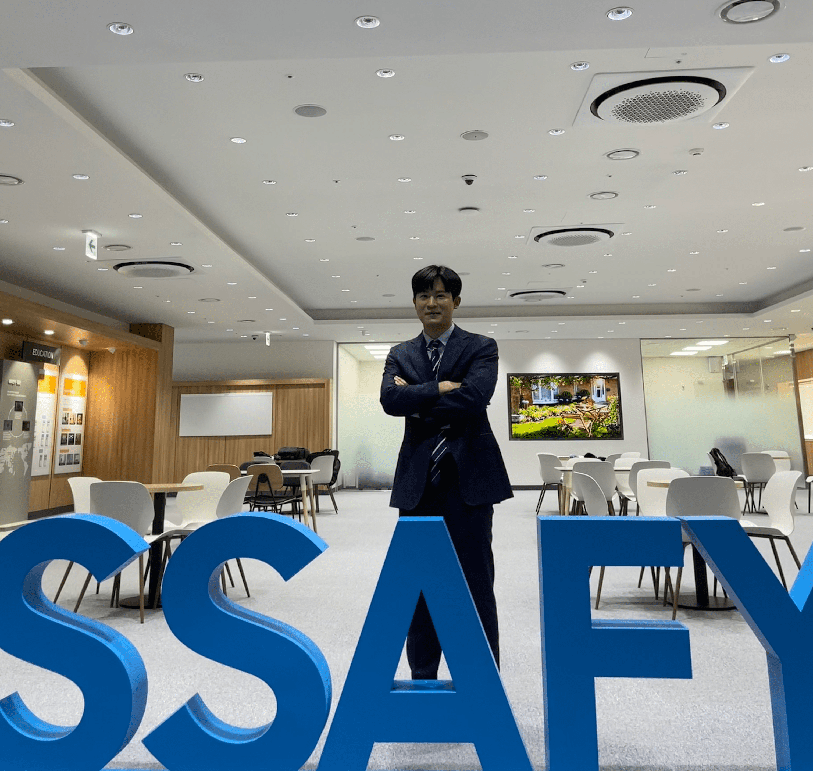

### 생애 첫 기술 블로그

  삼성청년SW아카데미 6기에 입과하여 1년간 1600시간의 코딩 공부를 진행하면서 늘 기술블로그를 운영하고 싶은 마음이 가득했다. 새로운 기술을 남들보다 빠르게 습득하고 정리하여 성취지향적인 시니어 개발자 선배들을 닮고 싶었다. 하지만, 남들보다 늦게 개발을 시작하다보니 기초역량을 쌓고 프로젝트에 집중해야할 시간이 많았다는 핑계로 기술블로그를 미루다가 드디어 시작했다.

 

  본 블로그는 인프런에서 주현도님의 'React 기반 Gatsby로 개발하기' 강의를 통해 개발하게 되었다. 'Vue 하나라도 제대로 알자'라는 마음으로 vue공부에 집중하다보니 React를 하나도 모른 상태에서 시작했다. 아무래도 이해를 다 하지 못한채 개발하게 되었지만 지속적으로 업데이트를 하며 코드를 분석하고 개발하려고 한다.
 
 

**삼성청년SW 아카데미 6기 웰컴키트**

 

**첫 개발 공부를 시작했을 때** (뭔말인지 1도 모르지만, 뭔가 나 자신이 뿌듯해서 촬영함)

 

**1년 1600시간의 싸피 6기 수료**

---

## Source

- 주현도 님의 React 기반 Gatsby로 기술 블로그 개발하기
  [<https://www.inflearn.com/course/gatsby-%EA%B8%B0%EC%88%A0%EB%B8%94%EB%A1%9C%EA%B7%B8/dashboard>](https://www.inflearn.com/course/gatsby-%EA%B8%B0%EC%88%A0%EB%B8%94%EB%A1%9C%EA%B7%B8/dashboard)