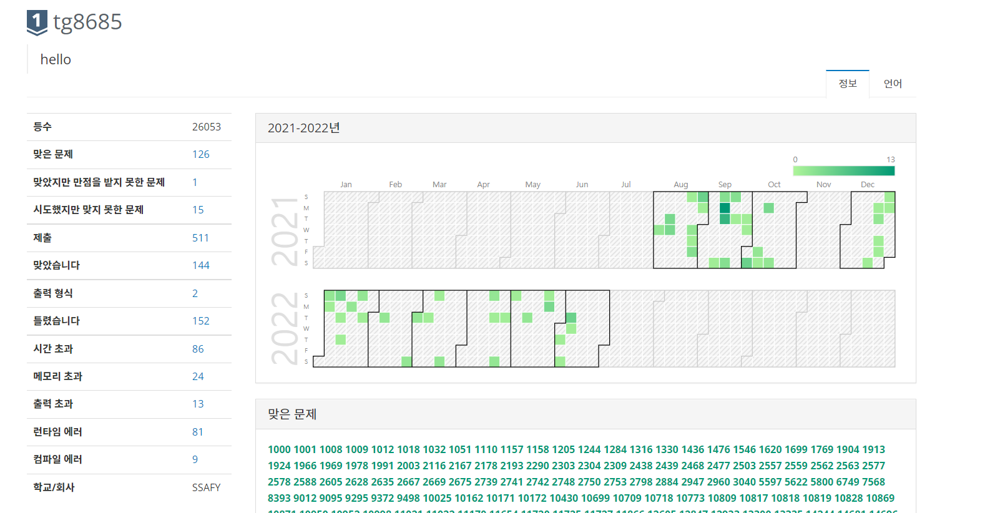

### 코딩테스트... 알고리즘...

어렸을 때는 수학, 과학 영재였고 수학경시대회에 나가서 상을 받을 만큼 나름(?) 머리가 좋다고 생각하며 살아왔다. 물론 고등학교를처음 알고리즘 문제를 풀면서 내가 똑똑한 편이 아니라는 사실을 많이 느꼈다.

 

작성중
 
 

#### 백준 현재 레벨

 

 

---

## Source

- 주현도 님의 React 기반 Gatsby로 기술 블로그 개발하기
  [<https://www.inflearn.com/course/gatsby-%EA%B8%B0%EC%88%A0%EB%B8%94%EB%A1%9C%EA%B7%B8/dashboard>](https://www.inflearn.com/course/gatsby-%EA%B8%B0%EC%88%A0%EB%B8%94%EB%A1%9C%EA%B7%B8/dashboard)
